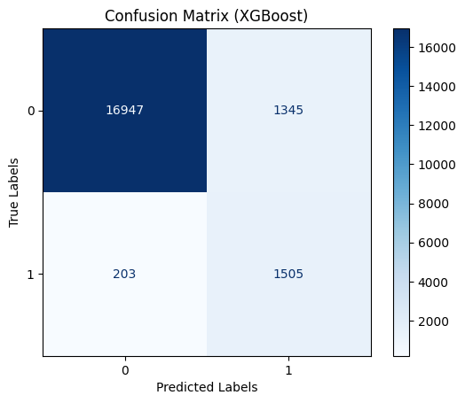

# ✨ Prediksi Penderita Diabetes ✨
## Klasifikasi Otomatis Penderita Diabetes dengan Random Forest dan XGBoost

Diabetes adalah penyakit kronis yang sering berkembang secara diam-diam namun memiliki dampak besar pada kesehatan. Penyakit ini terjadi ketika tubuh tidak mampu mengatur kadar gula darah dengan baik, yang dapat memicu berbagai komplikasi serius seperti penyakit jantung, kerusakan ginjal, gangguan penglihatan, hingga masalah saraf. Gejalanya sering kali muncul perlahan, seperti sering merasa haus, mudah lelah, sering buang air kecil, dan luka yang sulit sembuh. Hal ini menjadikan diabetes sebagai tantangan besar dalam dunia kesehatan, terutama karena gaya hidup modern yang semakin meningkatkan risiko penyakit ini.

Namun, kemajuan teknologi kini memungkinkan deteksi dini diabetes dengan bantuan prediksi berbasis kecerdasan buatan. Dengan memanfaatkan data medis dan demografi seperti usia, BMI, riwayat kesehatan, serta kadar gula darah, model pembelajaran mesin seperti Random Forest dan XGBoost dapat digunakan untuk memprediksi apakah seseorang berisiko terkena diabetes atau tidak. Solusi ini memudahkan tenaga medis dan individu untuk mengambil langkah pencegahan lebih awal, sehingga risiko komplikasi dapat diminimalkan dan kualitas hidup tetap terjaga.✨

### ✨Overview Dataset✨
Proyek ini menggunakan dataset Diabetes Prediction Dataset yang diambil dari platform Kaggle [Diabetes Prediction Dataset - Kaggle](https://www.kaggle.com/datasets/iammustafatz/diabetes-prediction-dataset). Dataset ini berisi sekitar 100.000 data medis dan demografi pasien, mencakup informasi penting seperti usia, jenis kelamin, indeks massa tubuh (BMI), riwayat hipertensi, penyakit jantung, kebiasaan merokok, kadar HbA1c, dan kadar glukosa darah, serta status diabetes pasien (positif atau negatif). Dataset ini dapat digunakan untuk membangun model pembelajaran mesin yang dapat memprediksi kemungkinan seseorang mengidap diabetes berdasarkan riwayat medis dan informasi demografis mereka. Dengan demikian, dataset ini memiliki potensi besar untuk mendukung pencegahan dini serta perencanaan perawatan yang lebih tepat dan personal.

### ✨Algorirtma Classification✨
- *Random Forest Classification*
  

Random Forest Classification adalah metode pembelajaran mesin yang digunakan untuk mengklasifikasikan data dengan cara membangun sejumlah pohon keputusan (decision trees) yang saling independen, kemudian menggabungkan hasil prediksi dari masing-masing pohon untuk menghasilkan keputusan akhir. Tujuan utamanya adalah untuk meningkatkan akurasi dan mengurangi risiko overfitting, yang sering terjadi pada pohon keputusan tunggal. Prosesnya dimulai dengan membangun banyak pohon keputusan dengan menggunakan sampel acak dari data pelatihan, dan setiap pohon memberikan prediksi berdasarkan fitur yang relevan. Hasil dari semua pohon ini kemudian digabungkan untuk memberikan prediksi yang lebih stabil dan akurat, menjadikan Random Forest sangat efektif untuk menangani dataset besar dengan banyak variabel.

- *XGBoost Classification*

XGBoost Classification adalah salah satu algoritma pembelajaran mesin paling kuat dan efisien yang digunakan untuk tugas klasifikasi. Dengan menggabungkan kekuatan beberapa model lemah (pohon keputusan) melalui teknik boosting, XGBoost berfokus pada perbaikan kesalahan yang dibuat oleh model sebelumnya, sehingga menghasilkan prediksi yang lebih akurat. Setiap pohon yang ditambahkan bekerja untuk mengoreksi kesalahan dari pohon sebelumnya, membuat model semakin kuat. Keunggulan XGBoost terletak pada kemampuannya untuk menangani data besar dengan cepat dan akurat, serta kemampuannya menghindari overfitting melalui regularisasi. Berkat kinerjanya yang luar biasa, XGBoost sering menjadi pilihan utama dalam kompetisi machine learning dan aplikasi dunia nyata.

### ✨Preprocessing, EDA, dan Train-split✨

Distribusi data menunjukkan ketimpangan yang signifikan, dengan 91.500 individu tanpa diabetes dibandingkan hanya 8.500 dengan diabetes. Hal ini mengindikasikan bahwa prediksi dalam proyek ini kemungkinan besar akan lebih sulit untuk mendeteksi kasus positif diabetes secara akurat karena dominasi data non-diabetes, walaupun meskipun model prediksi mungkin mencapai akurasi tinggi.

#### ✨*Random Forest Classification*✨
- Sebelum SMOTE
  

Dengan pembagian data train-test 80:20, hasil classification report sebelum SMOTE menunjukkan akurasi sebesar 97%.

- Sesudah SMOTE
SMOTE digunakan untuk menyeimbangkan kelas dengan membuat sampel sintetis kelas minoritas hingga 25% dari jumlah kelas mayoritas, sehingga mencapai perbandingan 1:4.

Hasil classification report setelah SMOTE menunjukkan akurasi tetap sebesar 97%, dengan peningkatan keseimbangan dalam mendeteksi kelas 1 (positif diabetes) meskipun recall mencapai 71%."

Kesimpulannya, penerapan SMOTE membantu model lebih seimbang dalam mendeteksi kasus positif diabetes tanpa mengorbankan akurasi keseluruhan.

#### ✨Confusion Matrix Random Forest✨

Dalam proyek ini, label **0** menunjukkan "Tidak Diabetes" dan label **1** menunjukkan "Diabetes." Berikut adalah penjelasan confusion matrix:

- **True Positive (TP)**: Data yang benar-benar menderita diabetes dan diprediksi sebagai diabetes.
- **False Negative (FN)**: Data yang benar-benar menderita diabetes tetapi diprediksi tidak diabetes.
- **False Positive (FP)**: Data yang tidak menderita diabetes tetapi diprediksi sebagai diabetes.
- **True Negative (TN)**: Data yang tidak menderita diabetes dan diprediksi tidak diabetes.

#### ✨Model Random Forest.sav✨
Model Random Forest yang telah dilatih tersedia untuk diunduh. Karena ukuran file yang cukup besar (sekitar 66,6 MB), Anda dapat mengunduhnya langsung melalui tautan di bawah ini:
[random_forest_model.sav](https://drive.google.com/drive/folders/1Vc6w4cCXNb2MD2t5zP8QpJJFVUxAcInC?usp=sharing)

### ✨*XGBoost Classification*✨

Menghitung scale_pos_weight bertujuan untuk menyeimbangkan bobot kelas mayoritas dan minoritas agar XGBoost tidak bias terhadap kelas mayoritas.

Classification report menunjukkan bahwa dengan train-test split 80:20, model XGBoost memiliki akurasi 92%, performa kuat pada kelas mayoritas (f1-score 0.96), namun performa terbatas pada kelas minoritas (f1-score 0.66).

#### ✨Confusion Matrix XGBoost✨

Dalam proyek ini, label **0** menunjukkan "Tidak Diabetes" dan label **1** menunjukkan "Diabetes." Berikut adalah penjelasan confusion matrix:

- **True Positive (TP)**: Data yang benar-benar menderita diabetes dan diprediksi sebagai diabetes.
- **False Negative (FN)**: Data yang benar-benar menderita diabetes tetapi diprediksi tidak diabetes.
- **False Positive (FP)**: Data yang tidak menderita diabetes tetapi diprediksi sebagai diabetes.
- **True Negative (TN)**: Data yang tidak menderita diabetes dan diprediksi tidak diabetes.

## ✨Tampilan Deploy Prediksi Diabetes✨

Proyek Hasil ini akan menunjukan apakah anda seorang penderita dari inputan usia, BMI, riwayat kesehatan, serta kadar gula darah sehingga menapilkan Prediksi anda terkena Diabetes Positif atau negatif.

Nanti ada visualisasi jika Diabetes Negatif (Tandanya Sehat) gambarnya:
  

visualisasi jika Diabetes Positif (Tandanya Terkena Penyakit Diabetes butuh waspada) gambarnya:

